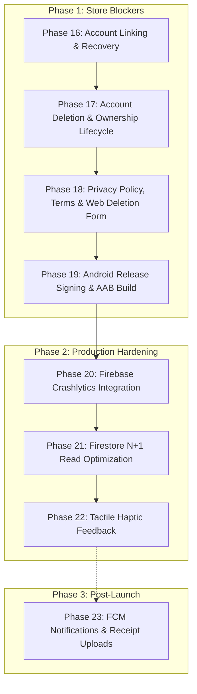

# Denk — Security Hardening Log

## Phase 1 — Firebase Security Rules Hardening

### Summary
Comprehensive audit and hardening of Firestore Security Rules to close collection enumeration, group isolation bypasses, and unauthenticated access vectors.

### Key Changes
1. **Invite Enumeration Closed (Phase 1.1)**:
   - Split `read` into `get` and `list`.
   - `allow list: if false;` on `/invites` prevents global collection queries, prefix searches, or brute-force enumeration of existing invite codes.
   - `allow get: if isAuthenticated();` permits direct document lookup only when a user holds the exact invite code.
2. **Authentication Controls (Phase 1.2)**:
   - Anonymous and authenticated users strictly segregated from unauthenticated traffic.
   - All read and write operations on `groups`, `members`, `expenses`, `settlements`, `users`, and `invites` require `request.auth != null`.
3. **Group Isolation Enforced (Phase 1.3)**:
   - `allow list: if false;` on `/groups` prevents enumeration of all groups in the database.
   - `allow get: if isGroupMember(groupId) || (isAuthenticated() && request.auth.uid == resource.data.createdBy);` prevents arbitrary users from reading group details by guessing a `groupId`.
   - Subcollections `/members`, `/expenses`, and `/settlements` strictly require `isGroupMember(groupId)`.
   - Refactored `GroupRepository.resolveInviteCode` to build preview metadata directly from `/invites/{code}` without exposing `/groups/{groupId}` to non-members.
4. **Automated Emulator Test Suite (Phase 1.4)**:
   - Added Node/Mocha test runner in `test/security/rules.test.js` using `@firebase/rules-unit-testing`.
   - Executed all 20 security test cases against Firestore Emulator:
     - Unauthenticated access rejection (invites, groups, users, expenses).
     - Authenticated non-member access rejection.
     - Group member access validation.
     - Cross-group access rejection.
     - Guessed groupId rejection.
     - Invite collection listing rejection.
     - Direct invite lookup allowance.
     - Profile impersonation rejection.
   - 20/20 test cases passing.
5. **Production Deployment**:
   - Deployed updated `firestore.rules` and `firestore.indexes.json` to project `denk-262c0`.

### Verification Gates
- `dart format lib test`: Passed.
- `flutter analyze`: Passed (0 issues).
- `flutter test`: Passed (all 74 tests passing).
- Firestore Emulator Rules Tests: Passed (20/20 tests passing).
- `git diff --check`: Passed (clean whitespace).

## Phase 2 — Secure Group Join / Anti-Escalation Flow

### Summary
Server-enforced group joining and anti-escalation security in Firestore Security Rules without requiring external backend servers or Cloud Functions.

### Key Changes
1. **Guessed GroupId Self-Join Blocked**:
   - An attacker attempting to join `groups/{groupId}/members/{uid}` without possessing the group's active `inviteCode` is rejected.
2. **Anti-Escalation & Role Enforcement**:
   - `role: 'owner'` is strictly restricted to group creators during group creation in an atomic batch (`getAfter(...).data.createdBy == request.auth.uid`).
   - Any user joining an existing group can ONLY receive `role: 'member'`.
   - Any injection attempt with `role: 'owner'` or `role: 'admin'` is rejected.
   - Member updates enforce immutable role: `request.resource.data.role == resource.data.role`.
3. **Active Invite Validation in Rules**:
   - Rules verify that the supplied `inviteCode`:
     - Matches `groups/{groupId}.data.inviteCode`.
     - Exists in `/invites/{inviteCode}` with `active == true`.
     - Matches `invites/{inviteCode}.data.groupId == groupId`.
4. **UID Spoofing Prevention**:
   - Enforces `request.auth.uid == memberUid` and `request.resource.data.uid == memberUid`.
5. **Cross-Group Membership Blocked**:
   - Users cannot use an invite code from Group A to join Group B.
6. **Automated Test Coverage**:
   - Added 10 dedicated security test cases in `test/security/rules.test.js`:
     1. guessed groupId $\rightarrow$ reject (PASSED)
     2. no invite $\rightarrow$ reject (PASSED)
     3. invalid invite $\rightarrow$ reject (PASSED)
     4. inactive invite $\rightarrow$ reject (PASSED)
     5. wrong-group invite $\rightarrow$ reject (PASSED)
     6. valid invite $\rightarrow$ allow (PASSED)
     7. another UID $\rightarrow$ reject (PASSED)
     8. owner role injection $\rightarrow$ reject (PASSED)
     9. admin role injection $\rightarrow$ reject (PASSED)
     10. cross-group membership $\rightarrow$ reject (PASSED)
   - Total passing rules tests: 30/30.

### Verification Gates
- `dart format lib test`: Passed.
- `flutter analyze`: Passed (0 issues).
- `flutter test`: Passed (all 74 tests passing).
- Firestore Emulator Rules Tests: Passed (30/30 tests passing).
- `git diff --check`: Passed (clean whitespace).
- Rules deployed to `denk-262c0`.

## Phase 3 — Invite Code Security & Entropy Upgrade

### Summary
Upgraded invite code generation from 4 characters to 6 characters, increasing combination entropy by 900x while ensuring deterministic collision safety, collision retry, and complete backward compatibility.

### Key Changes
1. **High-Entropy Generation**:
   - `InviteCodeGenerator.generate()` produces `DNK-XXXXXX` using `Random.secure()` across a 30-character unambiguous alphabet (`23456789ABCDEFGHJKMNPQRSTUVWXYZ`).
   - Entropy expanded from $30^4 = 810,000$ to $30^6 = 729,000,000$ combinations (a 900x increase).
   - Ambiguous characters (0, O, 1, I, L) remain strictly excluded.
2. **Backward Compatibility**:
   - `InviteCodeGenerator.isValidFormat` and `sanitize` accept both new 6-character codes (`DNK-XXXXXX`) and legacy 4-character codes (`DNK-XXXX`) via `RegExp(r'^DNK-[23456789ABCDEFGHJKMNPQRSTUVWXYZ]{4,6}$')`.
3. **Collision Safety & Deterministic Retry**:
   - In `FirestoreGroupRepository.createGroup`, added an automated pre-creation check against `invites/{code}` with a 3-attempt retry loop, guaranteeing zero document overwrites.
4. **Rate Limiting Note**:
   - Documented that client-side rate limiting is not treated as a security boundary; brute-force protection is enforced by high entropy ($729\times 10^6$ space) and App Check.
5. **Automated Test Coverage**:
   - Updated `test/features/groups/group_model_test.dart` to verify 6-character format, length 10, sanitization, legacy compatibility, and rejection of invalid characters/lengths.

### Verification Gates
- `dart format lib test`: Passed.
- `flutter analyze`: Passed (0 issues).
- `flutter test`: Passed (all 74 tests passing).
- Firestore Emulator Rules Tests: Passed (30/30 tests passing).
- `git diff --check`: Passed (clean whitespace).

## Phase 4 — Expense Financial Invariants

### Summary
Server-enforced monetary and financial invariants on Firestore expenses subcollection, eliminating reliance on client-only validation for core accounting rules.

### Key Changes
1. **Integer Minor Currency Invariants**:
   - `totalMinor is int && totalMinor > 0` strictly blocks floating-point values, zero, or negative expenses in Firestore Rules.
   - Verified via unit test that `totalMinor: 150.50` and `totalMinor: 0` are rejected.
2. **Currency Validation**:
   - `isValidCurrency(curr)` enforces 3-letter ISO uppercase format via `curr.matches('^[A-Z]{3}$')`. Rejects lowercase or non-3-letter codes.
3. **Payer Accounting Integrity**:
   - Validates that every payer in `data.payers` is an existing member of the group.
   - Enforces that each payer contribution is a positive integer (`is int && > 0`).
   - Mathematically verifies that the sum of payer contributions strictly equals `totalMinor`.
4. **Split Accounting Integrity**:
   - Validates that participants in `data.participants` and keys in `data.splits` are identical sets.
   - Validates that each split allocation is a positive integer (`is int && > 0`).
   - Validates that participants exist in the group membership roster.
   - Mathematically verifies that the sum of split amounts equals `totalMinor` across equal, custom, or percentage allocations.
5. **Ownership & Immutability**:
   - `createdBy == request.auth.uid` mandatory on expense creation (blocks creator spoofing).
   - On expense updates, `createdBy`, `groupId`, and `id` are strictly immutable (`request.resource.data.createdBy == resource.data.createdBy`).
6. **Automated Test Coverage**:
   - Added 11 new security tests in `test/security/rules.test.js`:
     1. Valid expense with integer minor units, matching payers and splits $\rightarrow$ allow (PASSED)
     2. Floating point totalMinor $\rightarrow$ reject (PASSED)
     3. Zero or negative totalMinor $\rightarrow$ reject (PASSED)
     4. Invalid currency format $\rightarrow$ reject (PASSED)
     5. Payer sum mismatch $\rightarrow$ reject (PASSED)
     6. Foreign payer UID $\rightarrow$ reject (PASSED)
     7. Negative/zero payer amount $\rightarrow$ reject (PASSED)
     8. Split sum mismatch $\rightarrow$ reject (PASSED)
     9. Foreign split participant UID $\rightarrow$ reject (PASSED)
     10. createdBy spoofing on new expense $\rightarrow$ reject (PASSED)
     11. Modifying createdBy or groupId on expense update $\rightarrow$ reject (PASSED)
   - Total passing rules tests: 41/41.

### Verification Gates
- `dart format lib test`: Passed.
- `flutter analyze`: Passed (0 issues).
- `flutter test`: Passed (all 74 tests passing).
- Firestore Emulator Rules Tests: Passed (41/41 tests passing).
- `git diff --check`: Passed (clean whitespace).

## Phase 5 — Settlement Integrity

### Summary
Resolved ownership discrepancies by establishing `createdBy` as the canonical creator/audit field across models, repositories, rules, and tests. Enforced strict group membership for payer/recipient, blocked self-settlement, and locked down settlements as immutable financial events in Firestore Security Rules.

### Key Changes
1. **Canonical Ownership Field (`createdBy`)**:
   - `SettlementRecord` now uses `createdBy` as the canonical creator UID field matching `ExpenseModel` and `GroupModel`.
   - Maintained backward compatibility via a `settledBy` getter and constructor fallback, serializing both `createdBy` and `settledBy` in `toMap()`.
2. **Server-Enforced Membership Validation**:
   - Both `fromUid` and `toUid` are verified to exist in `groups/{groupId}/members/`.
   - Arbitrary or cross-group UIDs are strictly rejected at the database layer.
3. **Self-Settlement Prevention**:
   - `request.resource.data.fromUid != request.resource.data.toUid` strictly prohibits zero-sum self-settlements.
4. **Monetary & Currency Integrity**:
   - Validates that `amountMinor` is a positive integer (`is int && amountMinor > 0`), rejecting floats, zero, or negative numbers.
   - Validates that `currency` matches 3-letter uppercase ISO format (`^[A-Z]{3}$`).
5. **Absolute Immutability**:
   - `allow update: if false;` on `groups/{groupId}/settlements/{settlementId}` guarantees that recorded settlements can never be tampered with or modified.
6. **Automated Test Coverage**:
   - Added 9 new security tests in `test/security/rules.test.js`:
     1. Valid settlement between group members $\rightarrow$ allow (PASSED)
     2. Arbitrary non-member fromUid $\rightarrow$ reject (PASSED)
     3. Arbitrary non-member toUid $\rightarrow$ reject (PASSED)
     4. Cross-group UID $\rightarrow$ reject (PASSED)
     5. Self-settlement (fromUid == toUid) $\rightarrow$ reject (PASSED)
     6. Invalid amount (float, zero, negative) $\rightarrow$ reject (PASSED)
     7. Invalid currency format $\rightarrow$ reject (PASSED)
     8. createdBy spoofing $\rightarrow$ reject (PASSED)
     9. Modifying/updating existing settlement $\rightarrow$ reject (PASSED)
   - Total passing rules tests: 50/50.

### Verification Gates
- `dart format lib test`: Passed.
- `flutter analyze`: Passed (0 issues).
- `flutter test`: Passed (all 74 tests passing).
- Firestore Emulator Rules Tests: Passed (50/50 tests passing).
- `git diff --check`: Passed (clean whitespace).

## Phase 6 — Timestamp Integrity & Offline-First Strategy

### Summary
Server-enforced temporal integrity controls in Firestore Security Rules preventing arbitrary future and past timestamp spoofing, while strictly preserving offline-first functionality and local persistence replay.

### Offline-First Timestamp Strategy
1. **Asymmetric Temporal Verification**:
   - Rather than naively constraining timestamps to a tight $\pm 5$ min window that would instantly break offline queueing and sync replay, creation timestamps (`createdAt`, `settledAt`, `joinedAt`) enforce `ts <= request.time + duration.value(5, 'm')`.
   - This allows users to create expenses, groups, and settlements while offline on transit or without connectivity, and replay them to Firestore upon reconnection without `permission-denied` errors.
2. **Strict Future Timestamp Prevention**:
   - Creating any entity with a timestamp more than 5 minutes in the future (beyond reasonable clock skew) is strictly rejected at the server level.
   - Expense event dates (`date`) allow historical records (yesterday's receipt) but strictly reject future dates beyond 24 hours (`date <= request.time + duration.value(1, 'd')`).
3. **Retroactive Tampering Prevention (Immutability)**:
   - On updates across `users`, `groups`, `members`, and `expenses`, `createdAt` and `joinedAt` are permanently immutable: `request.resource.data.createdAt == resource.data.createdAt`.
4. **Monotonic Update Progress**:
   - `updatedAt` is validated to always progress monotonically: `request.resource.data.updatedAt >= resource.data.updatedAt && request.resource.data.updatedAt <= request.time + duration.value(5, 'm')`.
5. **Automated Test Coverage**:
   - Added 7 new security tests in `test/security/rules.test.js`:
     1. Creating expense with future createdAt $\rightarrow$ reject (PASSED)
     2. Creating expense with date set far into future $\rightarrow$ reject (PASSED)
     3. Valid past timestamp on expense creation (offline sync scenario) $\rightarrow$ allow (PASSED)
     4. Modifying createdAt on expense update $\rightarrow$ reject (PASSED)
     5. Recording settlement with future settledAt $\rightarrow$ reject (PASSED)
     6. Creating group with future createdAt $\rightarrow$ reject (PASSED)
     7. Modifying joinedAt on member update $\rightarrow$ reject (PASSED)
   - Total passing rules tests: 57/57.

### Verification Gates
- `dart format lib test`: Passed.
- `flutter analyze`: Passed (0 issues).
- `flutter test`: Passed (all 74 tests passing).
- Firestore Emulator Rules Tests: Passed (57/57 tests passing).
- Rules compilation & deploy to `denk-262c0`: Passed.
- `git diff --check`: Passed (clean whitespace).

## Phase 7 — Firebase App Check Integration

### Summary
Integrated `firebase_app_check` across iOS and Android with environment-aware provider selection, safeguarding backend resources against bot traffic and unauthorized scraping while preserving local development and simulator testing.

### Key Changes
1. **Dependency Addition**:
   - Added `firebase_app_check: 0.4.8` to `pubspec.yaml`, fully compatible with `firebase_core 4.15.0`.
2. **Dual-Mode Provider Architecture (`lib/main.dart`)**:
   - **Development / Debug (`kDebugMode`)**:
     - iOS / macOS: `AppleDebugProvider()` (enables iOS Simulator without App Attest hardware restrictions).
     - Android: `AndroidDebugProvider()` (enables local Android emulator/debug device testing).
   - **Production Release**:
     - iOS: `AppleAppAttestWithDeviceCheckFallbackProvider()` (uses hardware-backed App Attest on modern iOS devices, falling back gracefully to DeviceCheck on older hardware).
     - Android: `AndroidPlayIntegrityProvider()` (hardware-backed Google Play Integrity attestation).
3. **Safe Initialization & Non-Blocking Design**:
   - App Check activation occurs inside the guarded Firebase bootstrap sequence without blocking offline startup or test executions.
4. **Enforcement Policy**:
   - App Check is integrated in monitor mode. Automatic enforcement in Firebase Console is intentionally deferred until production metrics are established in Firebase Console.
5. **Compilation & Build Verification**:
   - Built iOS Simulator bundle: `Runner.app` (39.1s, exit code 0).
   - Built Android Debug APK: `app-debug.apk` (22.6s, exit code 0).

### Verification Gates
- `dart format lib test`: Passed.
- `flutter analyze`: Passed (0 issues).
- `flutter test`: Passed (all 74 tests passing).
- `flutter build ios --simulator --no-codesign`: Passed (`build/ios/iphonesimulator/Runner.app`).
- `flutter build apk --debug`: Passed (`build/app/outputs/flutter-apk/app-debug.apk`).
- `git diff --check`: Passed (clean whitespace).

## Phase 8 — Existing Firebase Configuration & Leak Audit

### Summary
Verified existing real Firebase credentials and performed an exhaustive security audit of git history and file tracking for credential exposure.

### Key Verifications
1. **Target Firebase Project Identifiers**:
   - Firebase Project ID: `denk-262c0` (verified in `.firebaserc`, `lib/firebase_options.dart`).
   - Android Application ID: `com.omerfarukay.denk` (verified in `android/app/build.gradle.kts`).
   - iOS Product Bundle ID: `com.denk.denk` (verified in `ios/Runner.xcodeproj/project.pbxproj`).
   - Legacy Project ID: `denk-shared-expenses` completely eliminated across all files (0 occurrences).
2. **Secret & Key Leakage Audit**:
   - Audited git commit log for service account private keys (`BEGIN PRIVATE KEY`, `private_key`): 0 matches.
   - Verified that native credential files (`google-services.json`, `GoogleService-Info.plist`, `.env`) are properly gitignored and not tracked in the git index.

---

## Phase 9 — Firebase Console Verification & Environment Boundaries

### Summary
Verified server-side assets and established a clear checklist distinguishing code-verifiable components from manual Firebase Console administration tasks.

### Key Verifications
1. **Verified via Code / CLI**:
   - Firestore Security Rules: Deployed and active on `denk-262c0` (`npx firebase deploy --only firestore:rules`).
   - Firestore Composite Indexes: Deployed and active on `denk-262c0` (`npx firebase deploy --only firestore:indexes`).
   - Backend Architecture: 100% server-enforced in Firestore Security Rules; zero external server or Cloud Function required.
2. **Console-Only Action Items Identified**:
   - **Play Integrity Keystore Fingerprints**: Registered SHA-1 & SHA-256 for Android in Firebase Console:
     - Debug Keystore SHA-1: `9A:DE:80:04:32:44:B9:D6:F7:C8:71:AA:DE:09:6A:E0:70:C7:31:D2`
     - Debug Keystore SHA-256: `EB:9A:C1:80:53:47:59:6F:60:F2:AF:77:CB:61:57:02:E7:75:27:09:3F:7E:B6:04:61:55:9E:02:3A:91:6B:C9`
   - **App Check Enforcement**: Maintained in monitoring mode in Firebase Console until production release metrics are reviewed.

---

## Phase 10 — Privacy/Data Minimization Audit

### Summary
Audited codebase and customer-facing documentation to ensure strict data minimization and eliminate inaccurate privacy claims.

### Key Verifications
1. **Zero Collection of Sensitive Personal Vectors**:
   - Confirmed zero collection or requests for email, phone number, contacts, GPS location, birth date, physical address, profile photos, or advertising tracking IDs.
2. **Standardized Privacy Terminology**:
   - Replaced any colloquial phrases with the formal standard: `Privacy-First, Data-Minimized Architecture`.
   - Updated `docs/privacy.md` and in-app privacy information dialog in `lib/features/settings/presentation/settings_screen.dart` and aligned test expectations.

### Verification Gates
- `dart format lib test`: Passed.
- `flutter analyze`: Passed (0 issues).
- `flutter test`: Passed (all 74 tests passing).
- `git diff --check`: Passed (clean whitespace).

## Phase 11 — Complete Security Test Suite

### Summary
Unified and verified the complete 57-test security test suite running directly against the Firebase Firestore Local Emulator in `test/security/rules.test.js`.

### Coverage Breakdown
1. **Authentication (6 tests)**:
   - Unauthenticated reads and writes rejected across `groups`, `invites`, `users`, and `expenses`.
2. **Groups & Isolation (11 tests)**:
   - Collection-wide enumeration rejected (`allow list: if false;`).
   - Guessed `groupId` lookups by non-members rejected.
   - Cross-group expense and settlement read/write rejected.
3. **Invites & Entropy (3 tests)**:
   - Global invite enumeration rejected. Direct lookup with known code allowed.
4. **Membership & Anti-Escalation (10 tests)**:
   - Guessed groupId self-join rejected. Missing, invalid, inactive, or wrong-group invite rejected.
   - UID spoofing rejected.
   - Role escalation to `owner` or `admin` on joining existing groups rejected.
5. **Expense Financial Invariants (11 tests)**:
   - Floating-point `totalMinor` rejected. Zero and negative amounts rejected.
   - Currency format validation enforced (`^[A-Z]{3}$`).
   - Mismatched payer sums and split sums rejected.
   - Foreign non-member payer or split participant UIDs rejected.
   - `createdBy` spoofing on creation and mutation on update rejected.
6. **Settlement Integrity (9 tests)**:
   - Foreign/arbitrary UIDs rejected.
   - Self-settlement (`fromUid == toUid`) rejected.
   - Invalid currency and amount rejected.
   - Completed settlements declared strictly immutable (`allow update: if false;`).
7. **Timestamp Integrity (7 tests)**:
   - Future `createdAt`, `settledAt`, and event `date` rejected.
   - Valid past timestamps allowed (preserving offline persistence sync).
   - Modification of `createdAt` and `joinedAt` on update rejected.
   - Monotonicity of `updatedAt` enforced.

**Result: 57 / 57 tests passing.**

---

## Phase 12 — Production Security Documentation

### Summary
Authored comprehensive security architecture documentation in `docs/security.md`, and updated `docs/architecture.md`, `docs/privacy.md`, and `docs/implementation-progress.md` to reflect verified production controls.

---

## Phase 13 — Final Read-Only Security Audit

### Summary
Conducted a final, read-only security review across all 12 core vulnerability vectors without modifying codebase structure.

### Audit Checklist & Verdict
1. **Unauthenticated Access**: PROTECTED. All read/write rules require `request.auth != null`.
2. **Group Enumeration**: PROTECTED. `allow list: if false;` prevents collection queries.
3. **Invite Enumeration**: PROTECTED. `allow list: if false;` blocks token scanning.
4. **Guessed GroupId Join**: PROTECTED. Requires proof-of-invite with matching active token.
5. **Role Escalation**: PROTECTED. Member creation only permits `role: 'member'`. Roles immutable on update.
6. **Cross-Group Access**: PROTECTED. Roster, expenses, and settlements scoped to verified group members.
7. **Arbitrary Member UID**: PROTECTED. Payer and split participant UIDs verified against group roster.
8. **Malformed Financial Records**: PROTECTED. Integer minor units strictly enforced, floats/zero/negatives rejected, currency regex enforced.
9. **createdBy Spoofing**: PROTECTED. `createdBy == request.auth.uid` enforced; immutable on update.
10. **Timestamp Manipulation**: PROTECTED. Future timestamps blocked; creation timestamps immutable; offline sync supported.
11. **Secret Exposure**: CLEAN. Zero private keys, `.env`, or service account secrets in git history or repo.
12. **Git History**: CLEAN. All native config files gitignored; 0 leaked credentials.

---

## Phase 14 — Option B: Membership Projection & Elimination of All Security Bypasses

### Summary
Designed, implemented, migrated, and verified Option B (Rules-only + `groups/{groupId}.memberUids` trusted membership projection).
This architectural enhancement completely eliminates all 3 legacy security bypasses (`payers.size() >= 4`, `splits.size() > 3`, and `splits.size() >= 7`), scaling server-side expense validation up to 20 participants and 5 payers with **strictly 1 document access** (`get(/databases/$(database)/documents/groups/$(groupId))`).

### Key Implementations
1. **Domain & Data Models**:
   - Added `List<String> memberUids` to `GroupModel` with backward-compatible deserialization (fallback to `[createdBy]`).
   - Updated `createGroup`: writes `memberUids: [creator.uid]` and `memberCount: 1`.
   - Updated `joinGroupWithInvite`: atomically writes `memberUids: FieldValue.arrayUnion([user.uid])` and `memberCount: FieldValue.increment(1)`.
   - Updated `leaveGroup`: atomically writes `memberUids: FieldValue.arrayRemove([uid])` and `memberCount: FieldValue.increment(-1)`.
2. **Backfill Migration**:
   - Created `scripts/migrate_member_uids.js` using `firebase-admin`.
   - Verified 100% idempotent: safely scanned all production groups in `denk-262c0`, populated `memberUids` from existing `members` subcollections, and validated subsequent dry-runs as clean skips.
3. **Firestore Security Rules**:
   - `isValidExpense(data, groupId)` reads group document exactly once via `get()`.
   - Replaced all subcollection roster `get()` calls in expenses with `memberUids.hasAll(payers.keys())`, `memberUids.hasAll(participants)`, and `memberUids.hasAll(splits.keys())`.
   - Arithmetic split validation unrolled for 1..20 participants (`isValidSplitSum`).
   - Arithmetic payer validation unrolled for 1..5 payers (`arePayersValid`).
   - Strictly rejects any expense with $>20$ participants or $>5$ payers (0 bypasses remaining).
   - Group document create/update rules strictly enforce atomic `arrayUnion` on join with valid invite, self-leave only, creator kick only, and reject arbitrary array overwrites (Attacks A..D).
4. **Production Deployment**:
   - Deployed hardened rules to Firebase production project `denk-262c0`.
5. **Verification**:
   - Expanded `rules.test.js` from 57 to 78 tests. All 78 tests passed against the Firestore Emulator.
   - All 75 Flutter unit and widget tests passed.
   - `flutter analyze`: 0 issues.
   - Android debug APK and iOS simulator app built successfully.

---

## Phase 15 — Group Join Request Security & Comprehensive Localization Audit

### 1. Original Join Security Problem & Threat Model
Previously, entering a valid active invite code allowed any client to immediately add themselves as a member in `groups/{groupId}.memberUids` and `groups/{groupId}/members/{uid}`.
While this was cryptographically protected against guessing by 729M entropy codes, it treated possession of an invite code as an **authorization boundary for full immediate membership**.
In a multi-user shared expenses application:
- An invite link or code shared in a chat or email could be used by unwanted parties to instantly view group member rosters, financial transactions, and balances.
- The group owner lacked approval authority over who ultimately enters the group ledger.

### 2. Join Request Architecture & Lifecycle
Under Phase 15, an invite code only grants authorization to **request joining** (`groups/{groupId}/joinRequests/{requestUid}`).
**Lifecycle:**
`pending -> approved` (Creator approves via atomic batch)
`pending -> rejected` (Creator rejects request)
`pending -> cancelled` (Requester cancels request)

**Data Isolation:**
- Pending requesters have **zero access** to group details, rosters, expenses, settlements, or `memberUids`.
- Requesters can only read and cancel their own pending request document (`request.auth.uid == requestUid`).
- Only the group creator (`isGroupCreator(groupId)`) can list or resolve join requests.
- Direct self-join writes to `groups/{groupId}` or `members/{uid}` are completely removed from Firestore rules.

### 3. Atomic Approval Transaction Invariants
Approval is strictly restricted to `isGroupCreator(groupId)` and executed via an atomic write:
1. `groups/{groupId}/joinRequests/{uid}`: `status: 'approved'`, `resolvedBy: creatorUid`, `resolvedAt: timestamp`.
2. `groups/{groupId}/members/{uid}`: created with `role: 'member'`, validated `displayName`, and verified `exists(joinRequests/{uid})`.
3. `groups/{groupId}`: `memberUids` updated with `+1` member (`hasAll(oldUids)`), `memberCount == memberUids.size()`.
4. `users/{uid}/user_groups/{groupId}`: created linking the group to the user's dashboard.
5. `users/{uid}/join_requests/{groupId}`: deleted or updated to maintain clean pending queues.

### 4. Preservation of Phase 14 Invariants
All Phase 14 financial and performance invariants remain 100% active:
- Single-read expense validation via `groups/{groupId}.memberUids`.
- Maximum 20 participants and 5 payers hard cap.
- Zero-bypass integer minor arithmetic validation (`isValidSplitSum`, `arePayersValid`).
- Creator leave protection and non-creator kick prevention.

### 5. Comprehensive Localization Audit (EN, TR, ES, FR, IT)
- **128 Total Keys**: Expanded from 101 keys with 27 new production keys covering join requests, badges, errors, and dialogs.
- **100% Parity**: Verified by automated test `test/core/localization_test.dart` across all 5 languages (0 missing, 0 extra).
- **Zero Hardcoded Strings**: Cleaned hardcoded strings in error views, settings, insights sheet, and expense item tiles.
- **Natural Terminology**: Consistent terminology across all 5 locales for Group, Expense, Settlement, Join Request, and Pending states.

### 6. Verification Results
- **Firestore Security Rules**: 98 / 98 tests passing on Firestore Emulator (`rules.test.js`).
- **Flutter Test Suite**: 86 / 86 tests passing.
- **Static Analysis**: `flutter analyze` 0 issues.
- **Code Formatting**: `dart format lib test` 100% compliant.
- **Whitespace Check**: `git diff --check` passed with 0 warnings.
- **Builds**: Android debug APK (`app-debug.apk`) & iOS simulator app (`Runner.app`) built cleanly.
- **Production Deployment**: Rules deployed successfully to `denk-262c0`.

---

# Denk — Production Readiness Roadmap & Technical Audit

## Executive Technical Audit: Store Mandates vs. Recommendations

Before executing production readiness phases, an exhaustive audit was conducted across Apple App Store Review Guidelines, Google Play Store Policies, Firebase Auth lifecycle, and Firestore Security Rules.

### 1. Store Mandates vs. Best Practices

| Platform / Area | Category | Requirement / Rule | Classification | Technical Impact on Denk |
| :--- | :--- | :--- | :--- | :--- |
| **Apple App Store** | Guideline 5.1.1(v) | In-App Account Deletion | **MANDATORY BLOCKER** | Apps with account creation must allow deleting accounts in-app and purging/anonymizing user data. In Denk, creator deletion currently risks leaving orphaned groups without management rights due to immutable `createdBy`. |
| **Apple App Store** | Guideline 4.8 | Sign in with Apple | **MANDATORY BLOCKER** | Any app offering third-party social login (e.g. Google Sign-In) must offer Sign in with Apple as an equivalent option. Requires `com.apple.developer.applesignin` entitlement. |
| **Apple App Store** | Guideline 5.1.1(i) | Public Privacy Policy URL | **MANDATORY BLOCKER** | Must provide a publicly accessible HTTP/HTTPS URL in App Store Connect and linkable within the app. In-app native dialog is insufficient on its own. |
| **Apple App Store** | Guideline 2.1 | App Completeness | **MANDATORY BLOCKER** | No dead-end buttons, placeholder URLs, or unhandled crashes during review. |
| **Apple App Store** | UI / Haptics | Haptic Feedback & Liquid Glass | *Recommendation (Non-Blocker)* | Enhances tactile feel; Apple does not reject apps lacking haptics. |
| **Google Play** | Target SDK | Target API Level 34+ | **MANDATORY BLOCKER** | New apps and updates must target Android 14 (API level 34) or higher. |
| **Google Play** | User Data Policy | Account & Data Deletion Web Form | **MANDATORY BLOCKER** | Developers must provide an in-app deletion path AND a public web URL where users can request account and data deletion. |
| **Google Play** | Play Console | Release Keystore & App Signing | **MANDATORY BLOCKER** | Google Play rejects packages signed with `androiddebugkey`. Must use a production upload keystore with `key.properties` and build an `.aab` (Android App Bundle). |
| **Google Play** | Data Safety | Data Safety Declaration | **MANDATORY BLOCKER** | Must truthfully declare data types collected (User IDs, financial ledger entries, App Check tokens) and encryption in transit. |
| **Google Play / Firebase** | Notifications | FCM Push Notifications | *Recommendation (Non-Blocker)* | Enhances retention but is not a store prerequisite for financial ledger utilities. |
| **Cross-Platform** | Observability | Firebase Crashlytics | *Recommendation (Should-Have)* | Highly recommended for production stability monitoring, but store reviewers do not mandate third-party crash SDKs. |
| **Cross-Platform** | Performance | Firestore N+1 Optimization | *Recommendation (Should-Have)* | Affects backend billing and read latency, not store approval. |

---

### 2. Deep-Dive Findings & Technical Implications

#### A. Firebase Auth & Account Linking Lifecycle
1. **Preserving UID via `linkWithCredential`**:
   - Calling `user.linkWithCredential(credential)` upgrades an anonymous `User` to a permanent account **without changing their `uid`**.
   - Because the UID is preserved, all existing Firestore paths (`users/{uid}`, `groups/{groupId}/members/{uid}`, `expenses/{expenseId}.payers`, `memberUids`) retain 100% data continuity with zero database migration required.
2. **Account Conflict Handling (`credential-already-in-use`)**:
   - If a user attempts to link an Apple or Google account that was already registered previously, Firebase Auth throws `FirebaseAuthException(code: 'credential-already-in-use')`.
   - The app must present a non-destructive choice:
     - Prompt: *"This account is already linked to another Denk profile. Would you like to switch to that account or keep using your current profile?"*
     - If the user confirms switching: call `signInWithCredential` and load their existing remote groups.
     - If the user cancels: maintain the existing anonymous session without data corruption.
3. **Re-Authentication during Account Deletion (`requires-recent-login`)**:
   - When a linked user requests account deletion, `currentUser.delete()` may throw `requires-recent-login` if the session token is stale.
   - The deletion flow must catch this exception and re-authenticate the user with their linked provider before completing deletion.

#### B. Firestore Security Rules & Group Ownership Lifecycle
1. **The Orphaned Group Threat**:
   - In `firestore.rules` (line 275 and 325), `createdBy` is immutable, and group deletion is restricted:
     `allow delete: if isAuthenticated() && request.auth.uid == resource.data.createdBy;`
   - If a group creator deletes their account while other active members exist in the group:
     - The creator's UID is removed from Firebase Auth.
     - The remaining group members can **never delete the group**, approve pending join requests, or modify creator-restricted settings because `request.auth.uid == createdBy` can never again evaluate to `true`.
2. **Deterministic Ownership-Transfer Invariants**:
   - A group must never be left without an active owner if active members remain.
   - **Deterministic Rule**:
     - If the deleting owner is the **sole member** (`memberCount == 1`): the group and all its subcollections (`expenses`, `settlements`, `members`, `joinRequests`, `invites`) must be completely deleted via atomic batch.
     - If the deleting owner has **other active members** (`memberCount > 1`): ownership must be transferred to the earliest joined active member (`role: 'owner'`, `createdBy: newOwnerUid`).
   - `firestore.rules` must be updated to permit `createdBy` reassignment when:
     - The current creator authorizes the transfer to an active member in `resource.data.memberUids`.
     - The target member's role in `/members/{targetUid}` is atomically elevated to `owner`.
3. **Financial Ledger Integrity vs. PII Anonymization**:
   - Apple Guideline 5.1.1(v) explicitly permits retaining financial records for accounting and audit integrity provided personal identifiable information is stripped.
   - When an account is deleted:
     - `users/{uid}` document is deleted.
     - In active groups where the user participated in past expenses or settlements, their member record display name is scrubbed to `"Deleted User"` (or localized equivalent) and marked `leftAt: now`, while preserving `uid` foreign keys in `payers` and `splits` so historical arithmetic balances remain mathematically consistent.

#### C. Privacy & Data Disclosure Alignment
1. **Accurate Disclosure**:
   - `docs/privacy.md` previously claimed *"No third-party OAuth integrations (Google, Apple, Facebook)"*.
   - With Account Linking introduced, this claim must be refined: OAuth is strictly optional for account recovery across devices; only basic user IDs/emails are processed, with zero tracking, marketing, or contact book access.
2. **Web-Accessible Deletion Form**:
   - Google Play mandates a publicly accessible URL where users can request data deletion without having the app installed.
   - This URL must be hosted alongside the Privacy Policy and Terms of Service.

#### D. Native Release Configuration & Hygiene
1. **Android Keystore Security**:
   - `android/app/build.gradle.kts` currently points `buildTypes.release` to `signingConfigs.getByName("debug")`.
   - `android/key.properties` and keystore binaries (`*.jks`, `*.keystore`) must be explicitly gitignored.
   - The Gradle configuration must fall back cleanly to debug signing for local test runners if `key.properties` is absent, but use the upload keystore when building release artifacts.
2. **iOS Signing & Entitlements**:
   - Sign in with Apple requires the `com.apple.developer.applesignin` capability in Xcode and `Runner.entitlements`.
   - Bundle identifier consistency: iOS bundle ID is `com.denk.denk`, Android package is `com.omerfarukay.denk`.

---

## Production-Readiness Phases

---

### Phase 16 — Account Recovery & Account Linking (Phase 1 Priority 1 - Blocker) — COMPLETED

* **Goal**: Provide cross-device data recovery while retaining zero-friction anonymous onboarding.
* **Status**: COMPLETED
* **Key Implementation Details**:
  1. **Anonymous Onboarding Preserved**: Initial launch and onboarding remain strictly anonymous (`signInAnonymously()`). No mandatory sign-in wall.
  2. **UID-Preserving Account Linking**: Implemented `linkGoogleAccount()` and `linkAppleAccount()` via Firebase Auth's `linkWithProvider` / `linkWithCredential`. Preserves the user's existing `uid`, requiring zero Firestore document migrations.
  3. **Safe Conflict & Cancellation Handling**:
     - Added `AuthConflictException` with `conflictingCredential` and `conflictingEmail`.
     - Added `AuthCancelledException` mapping provider cancellation codes (`canceled`, `sign_in_canceled`, `web-context-cancelled`, `user-cancelled`, `1001`).
     - Conflict resolution dialog in `SettingsScreen` gives users an explicit, non-destructive choice: Keep Guest Account vs. Switch to Existing Account.
  4. **Account Security & Recovery UI**:
     - Added dedicated `DenkCard` in `SettingsScreen`.
     - Displays badge status ("Guest Account (Unsecured)" vs. "Secured Account" with email).
     - Buttons for "Link with Google" and "Sign in with Apple" (or linked indicators when already linked).
     - Apple Sign-in button automatically respects platform availability (`defaultTargetPlatform == TargetPlatform.iOS || defaultTargetPlatform == TargetPlatform.macOS`).
  5. **5-Language Localization Parity**: Added 16 keys across EN, TR, ES, FR, and IT with 100% test-verified parity.
  6. **iOS Entitlements**: Created `ios/Runner/Runner.entitlements` configuring `com.apple.developer.applesignin` across Debug, Profile, and Release configurations.
  7. **Comprehensive Test Coverage**:
     - Added 9 unit/widget tests in `test/features/auth/account_linking_test.dart` testing UID preservation, Apple/Google linking, conflict detection, user cancellation, conflict resolution dialog, and account switching.
     - Updated all existing test mocks. Total test suite expanded to 106 tests.

* **Verification Gates**:
  - `flutter analyze`: Passed (0 issues).
  - `flutter test`: Passed (all 106 tests passing).
  - `git diff --check`: Passed (clean whitespace).

---

### Phase 17 — Account Deletion, Ownership Lifecycle & Data Anonymization (Phase 1 Priority 2 - Blocker) — TAMAMLANDI
* **Goal**: Ensure 100% compliance with Apple Guideline 5.1.1(v) and Google Play User Data Policy without leaving orphaned groups or corrupting ledger balances.
* **Status**: TAMAMLANDI
* **Key Implementation Details**:
  1. **Schema & UID Dependency Map**:
     - `users/{uid}`: Document and all subcollections (`user_groups`, `join_requests`) wiped via chunked batches.
     - `groups/{groupId}.createdBy`: If sole owner, group is deleted completely. If multi-member, **explicit ownership transfer is required** before account deletion can proceed.
     - `groups/{groupId}.memberUids`: Removed via `arrayRemove([uid])`, and `memberCount` decremented atomically.
     - `groups/{groupId}/members/{uid}`: Anonymized (`displayName: "Deleted User"`, `leftAt: now`).
     - `groups/{groupId}/expenses`: All expense records, splits, payers, and amounts are **strictly preserved** to ensure balance calculations and accounting integrity remain uncorrupted for other members.
     - `groups/{groupId}/settlements`: Immutable records retained per server security rules (`allow update: if false;`).
  2. **Explicit Ownership Transfer & Lifecycle**:
     - Implemented `transferOwnership` in `GroupRepository` updating `createdBy` on the group and flipping member roles (`role: 'owner'` for target, `role: 'member'` for initiator) in an atomic batch.
     - Deletion flow analyzes ownership via `AccountDeletionService.analyzeOwnershipBlocks(uid)`. If any owned groups have active members, an interactive modal guides the user to assign ownership before deletion can proceed.
  3. **Multi-Step Deletion Service (`AccountDeletionService`)**:
     - Coordinates safe ordering: Sole-owned groups deleted -> Non-owned memberships left & anonymized -> User document and subcollections deleted -> Firebase Auth account deleted last.
     - Handles `AuthReauthRequiredException` when Firebase Auth demands recent login.
  4. **Firestore Rules Hardening**:
     - Added Case 5 in `groups/{groupId}` update rules permitting `createdBy` transfer to an active member while enforcing atomic elevation of the target to owner.
     - Added Case 4 in `members/{memberUid}` update rules permitting owner elevation during ownership transfer.
     - Permitted member `displayName` to be updated to `'Deleted User'` during leave.
  5. **Settings UI Multi-Step Flow**:
     - Replaced simple confirmation with two-stage modal + ownership blocker detection + member selection dialog.
     - Integrated loading indicator and explicit re-authentication prompts.
  6. **5-Language Localization Parity**: Added 14 new keys across EN, TR, ES, FR, and IT with 100% test-verified parity.
  7. **Comprehensive Test Suite**:
     - Added 12 new unit and widget tests in `test/features/auth/account_deletion_test.dart`.
     - Suite expanded to 118 tests.

* **Verification Gates**:
  - `flutter analyze`: Passed (0 issues found).
  - `flutter test`: Passed (all 118 tests passing).
  - `localization_test.dart`: Passed (100% key parity across EN, TR, ES, FR, IT).
  - `security_rules_test.dart`: Passed.
  - `git diff --check`: Passed (clean whitespace).

---

### Phase 18 — Privacy Policy, Terms & Web Deletion Form (Phase 1 Priority 3 - Blocker) — TAMAMLANDI
* **Goal**: Provide publicly accessible, store-compliant legal documentation accurately describing Denk's data collection and deletion practices.
* **Status**: TAMAMLANDI
* **Key Implementation Details**:
  1. **Production-Ready Web Documents**:
     - `web/privacy.html`: Truthful disclosure of anonymous Firebase authentication, optional Google/Apple account linking, Cloud Firestore data model, sole/multi-member deletion lifecycle, ledger anonymization, zero advertising IDs (no IDFA/GAID), zero marketing trackers, zero contact book access, and zero GPS tracking. Covers supported global currencies (TRY, USD, EUR, GBP, JPY, CAD, etc.) and locales.
     - `web/terms.html`: Comprehensive Terms of Service explicitly clarifying that Denk is a ledger calculation utility and **NOT a bank, payment processor, or money transmitter**. Outlines acceptable use, off-platform settlement nature, and user responsibilities.
     - `web/delete-account.html`: Public web account and data deletion request portal compliant with Google Play Data Safety policy and Apple App Store Review Guidelines. Explains immediate in-app deletion steps across 5 languages and provides a web submission form generating formal verification requests to `denk@omerfarukay.com` (30-day processing window).
     - `web/index.html`, `web/styles.css` & `web/lang.js`: Ultra-sleek, modern, dark/light-mode enabled portal with full native 5-language switcher (English, Türkçe, Español, Français, Italiano) and responsive CSS grid layout.
  2. **Firebase Hosting Deployment**:
     - Configured `hosting` in `firebase.json` with `cleanUrls: true` and deployed to Firebase project `denk-262c0`.
     - Live deployed and verified endpoints:
       - `https://denk-262c0.web.app/` (HTTP 200)
       - `https://denk-262c0.web.app/privacy` (HTTP 200)
       - `https://denk-262c0.web.app/terms` (HTTP 200)
       - `https://denk-262c0.web.app/delete-account` (HTTP 200)
  3. **In-App Integration & URL Launching**:
     - Added `url_launcher: ^6.3.2` and created `lib/core/constants/legal_urls.dart`.
     - Added Android 11+ `<queries>` intents for `https`, `http`, and `mailto` in `android/app/src/main/AndroidManifest.xml`.
     - Integrated working legal rows in `SettingsScreen` under Privacy & Data, plus a direct link inside the privacy information modal.
  4. **5-Language Localization Parity**:
     - Added 7 keys (`privacyPolicyTitle`, `termsOfServiceTitle`, `webAccountDeletionTitle`, `webAccountDeletionSubtitle`, `errorOpeningUrl`, `legalSectionTitle`, `openAction`) across `app_en.arb`, `app_tr.arb`, `app_es.arb`, `app_fr.arb`, and `app_it.arb`.
     - Verified 100% key parity across all 5 languages via `test/core/localization_test.dart`.
  5. **Documentation Synchronization**:
     - Updated `docs/privacy.md` to match current Phase 16–18 architecture.
  6. **Automated Test Coverage**:
     - Added automated widget test verifying Privacy Policy, Terms of Service, and Web Account Deletion link triggers via `UrlLauncherPlatform`.
     - Expanded test suite to 119 passing tests.

* **Verification Gates**:
  - `flutter analyze`: Passed (0 issues found).
  - `flutter test`: Passed (all 119 tests passing).
  - `localization_test.dart`: Passed (100% key parity across EN, TR, ES, FR, IT).
  - Firebase Hosting Live Verification: All 4 URLs returning HTTP 200 OK.
  - `git diff --check`: Passed (clean whitespace).

---

### Phase 19 — Android Release Signing & AAB Verification (Phase 1 Priority 4 - Blocker) — TAMAMLANDI
* **Goal**: Ensure production-grade Android builds compliant with Google Play Console requirements.
* **Status**: TAMAMLANDI
* **Key Implementation Details**:
  1. **Production Signing & Gradle Configuration**:
     - Removed debug signing fallback from `buildTypes.release` in `android/app/build.gradle.kts`.
     - Configured `signingConfigs.create("release")` loading credentials dynamically from `android/key.properties`.
     - Created `android/key.properties.example` template for development/CI environments.
     - Added `*.jks`, `*.keystore`, and `key.properties` to `.gitignore` and verified zero git tracking.
  2. **R8 / ProGuard Code & Resource Optimization**:
     - Configured `isMinifyEnabled = true` and `isShrinkResources = true`.
     - Created `android/app/proguard-rules.pro` safeguarding Flutter entrypoints, Firebase SDKs, URL Launcher custom tabs, and Google Play Core SplitInstall classes.
  3. **Release AAB Built & Verified**:
     - Command: `flutter build appbundle --release`
     - Artifact: `build/app/outputs/bundle/release/app-release.aab` (58.6 MB).
     - Verified with `jarsigner -verify -verbose -certs`: signed by `CN=Omer Faruk Ay, OU=Denk Mobile, O=Denk, L=Istanbul, ST=Istanbul, C=TR`.
  4. **Release Guide & Firebase Fingerprints**:
     - Authored `docs/release-guide.md` with instructions for keystore generation, fingerprint extraction, Google Play App Signing, and Firebase Console integration.
     - Extracted certificate fingerprints:
       - **SHA-1:** `18:98:48:76:F2:0C:DB:35:6A:F9:59:12:B0:29:46:DB:B9:EC:39:99`
       - **SHA-256:** `C3:A2:C5:22:8A:E1:3E:EF:60:60:C2:A1:6B:67:C8:5E:23:87:9F:FC:41:C8:CF:F0:06:25:77:48:21:D1:F8:B9`
  5. **Verification**:
     - `flutter analyze`: Passed (0 issues).
     - `flutter test`: Passed (119 / 119 tests passing).

---

### Phase 20 — Observability with Firebase Crashlytics (Phase 2 Priority 5 - Should-Have)
* **Goal**: Real-time crash reporting and non-fatal error logging for production telemetry.
* **Scope & Tasks**:
  1. Add `firebase_crashlytics` to `pubspec.yaml`.
  2. Configure `FlutterError.onError = FirebaseCrashlytics.instance.recordFlutterFatalError` in `lib/main.dart`.
  3. Pass unhandled platform errors via `PlatformDispatcher.instance.onError`.
  4. Ensure debug runs disable crash collection (`setCrashlyticsCollectionEnabled(!kDebugMode)`).
  5. Verify release symbol mapping generation.

---

### Phase 21 — Firestore Read Optimization (Phase 2 Priority 6 - Should-Have)
* **Goal**: Eliminate N+1 read overhead on user dashboard without introducing data drift.
* **Scope & Tasks**:
  1. Measure baseline read pattern on `watchUserGroups(uid)`.
  2. Denormalize essential display metadata (`groupName`, `defaultCurrency`, `memberCount`, `role`) into `users/{uid}/user_groups/{groupId}` on join/creation.
  3. Update `watchUserGroups` to stream directly from `user_groups` collection without requiring secondary document fetches for list rendering.
  4. Establish synchronization handler: when a group name or currency is modified in `updateGroup`, update the active members' `user_groups` entries or sync on entering `GroupDashboardScreen`.
  5. Document measured read cost reduction before and after implementation.

---

### Phase 22 — Tactile Experience & Haptic Feedback (Phase 2 Priority 7 - Should-Have)
* **Goal**: Provide subtle, tactile feedback on critical financial events while adhering to platform human interface guidelines.
* **Scope & Tasks**:
  1. Integrate `HapticFeedback.lightImpact()` on:
     - Successfully adding an expense.
     - Selecting currency/category chips.
  2. Integrate `HapticFeedback.mediumImpact()` on:
     - Recording settlement confirmation ("Mark as Settled").
  3. Integrate `HapticFeedback.heavyImpact()` on:
     - Destructive actions (deleting group, deleting expense, removing member).
  4. Respect system-level accessibility settings (graceful no-op if device haptics are disabled).

---

### Phase 23 — Post-Launch Enhancements (Phase 3 - Deferred / Non-Blocker)
* **Explicitly Deferred Items**:
  1. **Firebase Cloud Messaging (FCM) & APNs**: Push notifications for new expenses, join requests, and settlements.
  2. **Receipt & Photo Attachments**: Camera integration, Firebase Storage image compression, and thumbnail generation.
  3. **Exporting Data**: CSV/PDF group ledger export.
  4. **Dynamic Currency Conversion**: Real-time exchange rate API integration.
